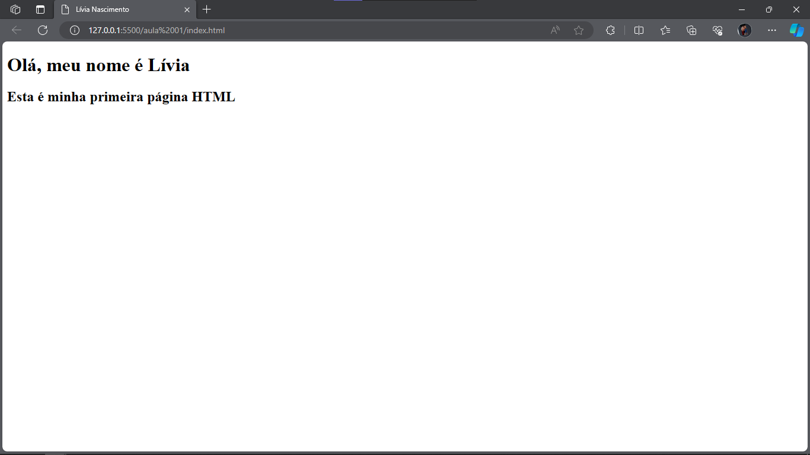

# Exercício 01

## ⚠ Lembrete importante

Para ter acesso à estrutura inicial do projeto, você pode fazer um fork desse repositório e clonar para a sua máquina.

## 📑 Passo a passo

1. Crie a estrutura básica de um HTML no arquivo [`index.html`](./index.html)

2. Mude o título da página para [seu nome] 

3. Insira uma tag `h1` com o texto "Olá, meu nome é [seu nome aqui]" 

4. Insira uma tag `h2` com o texto "Esta é minha primeira página HTML". 

Ao final desses passos, seu HTML deve ter mais ou menos o seguinte formato:

Se não conseguiu realizar o exercício ou ficou com alguma dúvida, volta lá no vídeo e deixa um comentário; ou fala comigo lá no LinkedIn! 

Bons estudos! 💜