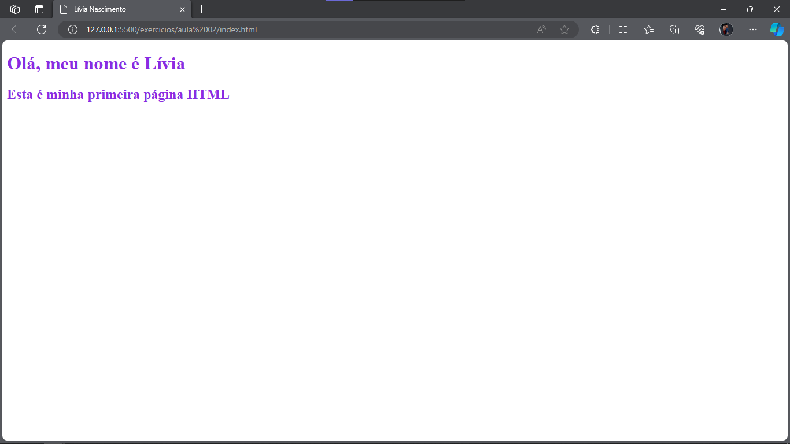

# Exercício 02

## ⚠ Lembrete importante

Para ter acesso à estrutura inicial do projeto, você pode fazer um fork desse repositório e clonar para a sua máquina.

## 📑 Passo a passo

1. Copie a solução do exercício anterior [`exercicios/aula 01/index.html`](../aula%2001/index.html) e cole no [`index.html`](./index.html) desta atividade.

2. Adicione o arquivo [`style.css`](./style.css) ao html.

3. Mude a cor dos textos usando o CSS para sua cor favorita.

Ao final desses passos, seu HTML deve ter mais ou menos o seguinte formato:

Se não conseguiu realizar o exercício ou ficou com alguma dúvida, volta lá no vídeo e deixa um comentário; ou fala comigo lá no [LinkedIn](https://www.linkedin.com/in/liviarnascimento/) ou manda um e-mail para [liviaraianen@gmail.com](mailto:liviaraianen@gmail.com)! 

Bons estudos! 💜