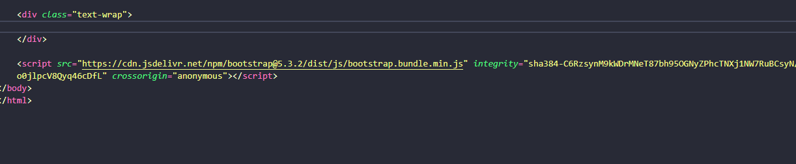
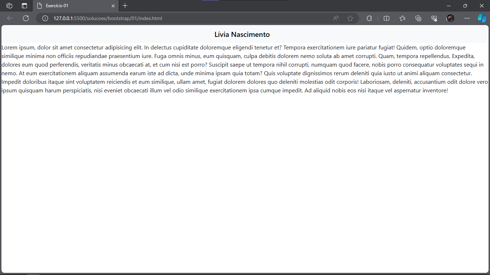
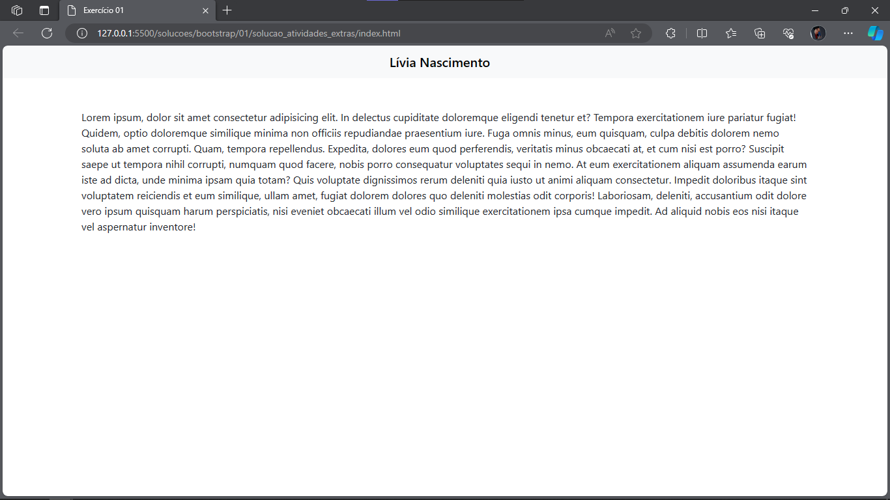

# Exercício 01 de Bootstrap

## 📝 Descrição 

Nesse exercício, você irá desenvolver uma página simples com HTML, CSS e Bootstrap contendo um cabeçalho fixo com seu nome e um texto lorem ipsum.

## 📑 Passo a passo

1. Crie a estrutura básica no arquivo [`index.html`](./index.html)

2. Adicione os links do CSS e do Javascript do Bootstrap no seu arquivo inicial

> 💡 Lembre-se que a tag `link` deve ficar no head e a tag `script` deve ficar no body.

3. Mude o título da sua página para "Exercício 01"

4. Copie a navbar disponível abaixo e cole-a no body

    ```html
    <nav class="navbar bg-body-tertiary">
        <div class="container-fluid">
            <span class="navbar-brand mb-0 h1">Navbar</span>
        </div>
    </nav>
    ```

5. Substitua o contéudo do `span` pelo seu nome

6. Centralize o texto do `span` como fizemos na [aula 03](https://www.youtube.com/watch?v=NAAkoBfpu1k&t=1038s)

7. Abaixo da `nav` crie uma `div` com a classe `text-wrap`

8. Dentro da div criada no passo anterior digite lorem*5 e clique no balão de sugestão



Ao final desses passos, seu HTML deve ter mais ou menos o seguinte formato:



## ➕ Atividades extras
> Para quem quer se aprofundar no conteúdo.

1. Pesquisar qual a função da classe text-wrap.

2. Pesquisar o que é Lorem Ipsum caso você ainda não saiba.

3. Alinhar o texto ao centro horizontalmente, utilizando apenas bootstrap.

4. Adicionar uma margem horizontal ao texto apenas com bootstrap.

5. Adicionar uma margem superior ao texto.

Tendo concluído os passos extras, a sua tela estará parecisa com essa:




## ✉ Contato

Se você tiver alguma dúvida ou precisar de assistência adicional, sinta-se à vontade para entrar em contato comigo em [liviaraianen@gmail.com](mailto:liviaraianen@gmail.com). 

Bons estudos! 💜