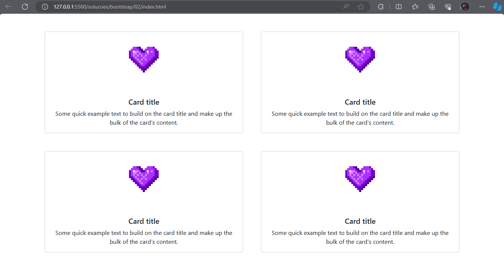

# Exercício 02 de Bootstrap

## 📝 Descrição 

Nesse exercício, você irá desenvolver uma página responsiva com HTML, CSS e Bootstrap que contém 4 cards, cada um com uma imagem, título e descrição.

## 📑 Passo a passo

1. Crie a estrutura básica no arquivo [`index.html`](./index.html) e adicione os links do CSS e do Javascript do Bootstrap

2. Mude o título da sua página para "Exercício 02"

3. Dentro do body, crie uma `div` com as classes `container` e `text-center`

4. Adicione duas `div` com as classes `row` e `gx-5` ao container 

5. Para dar responsividade, adicione duas colunas em cada row e garanta que elas ocupem metade das telas médias e grandes; e ocupem toda a largura de telas pequenas

6. Copie a estrutura do card disponível abaixo e cole 1x dentro de cada `<div class="col-12 col-md-6">`

    ```html
    <div class="card">
        
        <div class="card-body">
            <h5 class="card-title">Card title</h5>
            <p class="card-text">Some quick example text to build on the card title and make up the bulk of the card's content.</p>
        </div>
    </div>
    ```

7. Substitua o caminho das `img` de cada card pelo caminho correto da imagem que está na pasta [`assets`](./assets/)

8. Adicione o arquivo `style.css` ao `index.html` e garanta que todas as tags `img`:

- ocupem apenas metade do seu tamanho inicial
- tenham 30% da sua largura
- se alinhem ao centro

9. Adicione uma margem superior à todos os cards usando bootstrap

Ao final, seu site deverá se parecer com:



## ➕ Atividades extras
> Para quem quer se aprofundar no conteúdo.

1. Ler a documentação do Bootstrap Grid System disponível [aqui](https://getbootstrap.com/docs/5.3/layout/grid/).

2. Pesquisar qual é a função da classe `gx-5` que adicionamos às rows.

## ✉ Contato

Se você tiver alguma dúvida ou precisar de assistência adicional, sinta-se à vontade para entrar em contato comigo em [liviaraianen@gmail.com](mailto:liviaraianen@gmail.com). 

Bons estudos! 💜