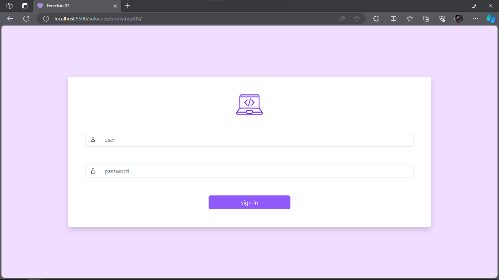

# Exercício 03 de Bootstrap

## 📝 Descrição 

A proposta do exercício 03 é criar o front-end de uma página de login responsiva. Acesse o projeto desse exercício no [Figma](https://www.figma.com/file/oPwKQXln2Ajp3PsbZUCnq0/exerc%C3%ADcio-03?type=design&node-id=1%3A2&mode=dev) para pré-visualizar a tela que desenvolveremos.

## 📑 Passo a passo

1. Crie a estrutura básica no arquivo [`index.html`](./index.html), adicione os links do CSS e do Javascript do Bootstrap e mude o título da sua página para "Exercício 03";

2. Mude a cor do background da página para qualquer cor de sua preferência;

3. Copie o form abaixo e o adicione à sua página dentro de um container com largura de 75%

    ```html
     <form>
        <div class="text-center">
          
        </div>
        <div class="input-group mb-5">
          <span class="input-group-text"><i class="bi bi-person"></i></span>
          <input type="email" class="form-control"  aria-describedby="emailHelp" placeholder="user">
        </div>
        <div class="input-group my-5">
          <span class="input-group-text"><i class="bi bi-lock"></i></span>
          <input type="password" class="form-control"  aria-describedby="emailHelp" placeholder="password">
        </div>
        <div class="d-grid col-8 col-md-3 mx-auto">
          <button type="submit" class="btn text-light" style="background-color: #8F5AFA;">sign in</button>
        </div>
      </form>
    ```

4. Garanta que o form:

    - tenha uma cor de fundo diferente do background que você escolheu no Passo 2;

    - esteja alinhado ao centro vertical e horizontalmente;

    - ocupe 75% da largura da tela;

5. Adicione o [`CDN do Bootstrap Icons`](https://www.bootstrapcdn.com/bootstrapicons/) e insira o icon `person` ao input `user` e o `lock` ao input `password`.

6. Ajuste o espaçamento entre os inputs, imagem e botão de acordo com sua preferência.

7. Adicione o favicon disponível na pasta [`assets`](./assets/) à página.

Ao final, seu site deverá se parecer com:



## ➕ Atividade extra
> Para quem quer se aprofundar no conteúdo.

1. Pesquisar qual a diferença entre `container` e `container-fluid` no bootstrap.

## ✉ Contato

Se você tiver alguma dúvida ou precisar de assistência adicional, sinta-se à vontade para entrar em contato comigo em [liviaraianen@gmail.com](mailto:liviaraianen@gmail.com). 

Bons estudos! 💜